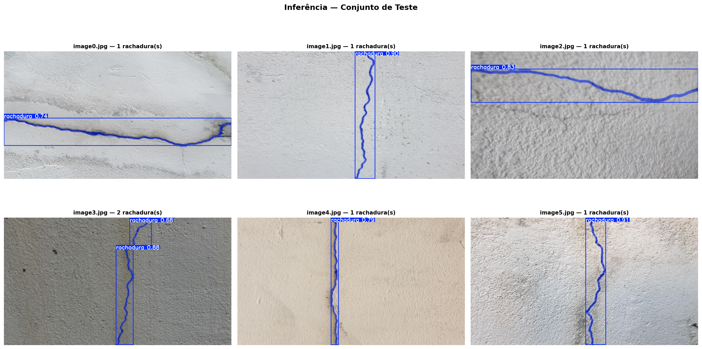

# Microserviço de detecção de rachaduras

Este projeto transforma o pipeline do notebook `inferencia_rachaduras.ipynb` em um microserviço FastAPI para inferência com o peso `best.pt`.

O serviço recebe uma imagem, executa a inferência com o YOLO fine-tunado, retorna a imagem anotada com máscara e expõe a contagem de rachaduras detectadas.

## Demonstração

### Interface web

<p align="center">
  
</p>

### Inferência no conjunto de teste

Resultado do modelo fine-tunado (`best.pt`) em imagens do conjunto de teste, com máscara de segmentação, caixa delimitadora e confiança de cada detecção.

<p align="center">
  
</p>

## Estrutura

- `app/main.py`: aplicação FastAPI, rotas e interface web.
- `app/inference.py`: carregamento do modelo e pós-processamento da inferência.
- `templates/index.html`: interface web básica.
- `static/styles.css`: estilos da interface.
- `best.pt`: peso pré-treinado usado na inferência.

## Endpoint

### `POST /api/predict`

Recebe um arquivo de imagem no campo `file` e retorna:

- `filename`: nome original do arquivo
- `count`: total de rachaduras detectadas
- `detections`: detalhes de cada detecção
- `image_base64`: imagem anotada em PNG, em formato data URL

Exemplo com `curl`:

```bash
curl -X POST "http://localhost:8000/api/predict" \
  -F "file=@sua_imagem.jpg"
```

## Executar localmente

```bash
python -m venv .venv
.venv\Scripts\activate
pip install -r requirements.txt
uvicorn app.main:app --reload
```

Acesse `http://localhost:8000`.

## Executar com Docker

```bash
docker build -t crack-detector .
docker run --rm -p 8000:8000 crack-detector
```

## Observações

- O modelo é carregado uma vez no startup da aplicação.
- A inferência é executada fora do event loop para evitar bloqueio do FastAPI.
- A resposta traz a imagem já anotada com a máscara e um rótulo de contagem no canto superior esquerdo.
